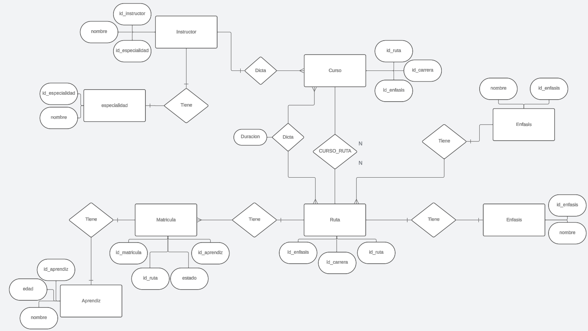
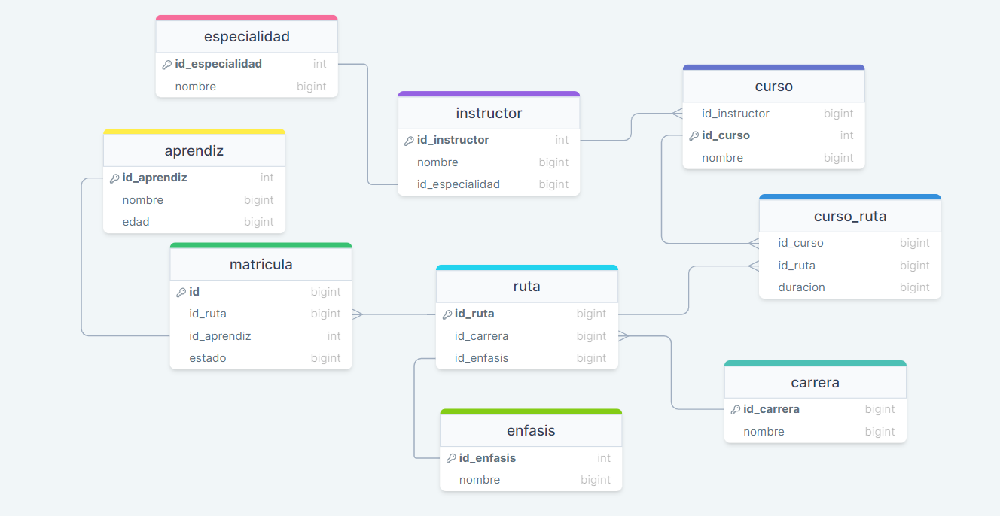

# ⚙️&nbsp; PROYECTO BASE DE DATOS&nbsp; 📑
Solución realizada por
Jose Gabriel Plata Ariza.


# 📚&nbsp; SOLUCION CONSULTAS&nbsp; 🕵️

### Para empezar, utilizamos la database creada.
```sql
USE proyect;
```


## **<span style="color:c07dff;font-weight:bolder;">1.&nbsp;</span>** se desea añadir un campo estado a la matricula del aprendiz
```sql
ALTER TABLE matricula
ADD estado ENUM('activo','cancelado','terminado') NOT NULL DEFAULT 'activo';
```
<br>

## **<span style="color:c07dff;font-weight:bolder;">2.</span>** &nbsp;se desea agregar el campo de edad a la tabla de aprendiz
```sql
ALTER TABLE aprendiz
ADD edad TINYINT UNSIGNED NOT NULL,
ADD CONSTRAINT edad_valida CHECK (edad >= 10 AND edad <= 120);
```
<br>

## **<span style="color:c07dff;font-weight:bolder;">3.</span>** &nbsp;Si los cursos tienen una duración diferente según la ruta, qué modificaría?
```sql
ALTER TABLE curso_ruta
ADD duracion DECIMAL NOT NULL;
```
<br>

## **<span style="color:c07dff;font-weight:bolder;">4.</span>** &nbsp;aprendices que están en la carrera de Electronica.
```sql
SELECT a.nombre AS nombre_aprendiz, a.edad AS edad, c.nombre AS carrera
FROM carrera AS c
JOIN ruta AS r ON r.id_carrera = c.id_carrera
JOIN matricula AS m ON m.id_ruta = r.id_ruta
JOIN aprendiz AS a ON a.id_aprendiz = m.id_aprendiz
WHERE c.nombre LIKE 'Electrónica' GROUP BY a.nombre, a.edad, c.nombre;
```
<br>

## **<span style="color:c07dff;font-weight:bolder;">5.</span>** &nbsp;Aprendices que cancelaron en la ruta de aprendizaje.
```sql
SELECT DISTINCT a.nombre AS nombre_aprendiz, e.nombre AS ruta, m.estado AS estado_matricula
FROM aprendiz AS a
JOIN matricula AS m ON m.id_aprendiz = a.id_aprendiz
JOIN ruta AS r ON r.id_ruta = m.id_ruta
JOIN enfasis AS e ON e.id_enfasis = r.id_enfasis
WHERE m.estado LIKE 'cancelado'
```
<br>

## **<span style="color:c07dff;font-weight:bolder;">6.</span>** &nbsp;Nombre de los cursos que no tienen un instructor asignado.
```sql
SELECT nombre AS nombre_curso, id_instructor AS instructor FROM curso WHERE id_instructor IS NULL;
```
<br>

## **<span style="color:c07dff;font-weight:bolder;">7.</span>** &nbsp;instructores que dictan cursos en la ruta “Sistemas de Información Empresariales”.
```sql
SELECT DISTINCT i.nombre AS instructor, c.nombre AS curso, cr.id_ruta AS Ruta, e.nombre AS enfasis
FROM curso_ruta AS cr
JOIN curso AS c ON c.id_curso = cr.id_curso
JOIN enfasis AS e ON e.id_enfasis = cr.id_ruta
JOIN instructor AS i ON i.id_instructor = c.id_instructor
WHERE cr.id_ruta = 1
```
<br>

## **<span style="color:c07dff;font-weight:bolder;">8.</span>** &nbsp;Aprendices que terminaron una carrera con su ruta.
```sql
SELECT DISTINCT a.nombre AS aprendiz, c.nombre AS carrera, e.nombre AS ruta_escogida, m.estado AS estado
FROM enfasis AS e
JOIN ruta AS r ON r.id_enfasis = e.id_enfasis
JOIN carrera AS c ON c.id_carrera = r.id_carrera
JOIN matricula AS m ON m.id_ruta = r.id_ruta
JOIN aprendiz AS a ON a.id_aprendiz = m.id_aprendiz
WHERE m.estado LIKE 'Terminado';
```
<br>

## **<span style="color:c07dff;font-weight:bolder;">9.</span>** &nbsp;Aprendices matriculados en "Bases de Datos Relacionales"
```sql
SELECT a.nombre AS aprendiz, c.nombre AS curso
FROM aprendiz AS a
JOIN matricula AS m ON m.id_aprendiz = a.id_aprendiz
JOIN ruta AS r ON r.id_ruta = m.id_ruta
JOIN curso_ruta AS cr ON cr.id_ruta = r.id_ruta
JOIN curso AS c ON c.id_curso = cr.id_curso
WHERE cr.id_curso = 17 GROUP BY a.nombre, c.nombre;
```

<br>

## **<span style="color:c07dff;font-weight:bolder;">10.</span>** &nbsp;Instructores que no tienen un curso asignado
```sql
SELECT i.nombre AS instructores_sin_curso FROM instructor AS i
LEFT JOIN curso AS c ON c.id_instructor = i.id_instructor
WHERE c.id_instructor IS NULL;
```
<hr>
<br>
<br>
<br>
<br>
<br>

# Bienvenido al Quiz de MySQL 👩‍💻📊
<br>

## 🤔 ¿Cuál es la diferencia entre INNER JOIN y LEFT JOIN en MySQL?
**<span style="color:#f03f3f;font-weight:bolder;">A)</span>** &nbsp;INNER JOIN devuelve solo los registros que tienen coincidencias en ambas tablas, mientras que LEFT JOIN devuelve todos los registros de la tabla izquierda y los registros coincidentes de la tabla derecha.

**<span style="color:#f03f3f;font-weight:bolder;">B)</span>** &nbsp;INNER JOIN devuelve todos los registros de ambas tablas, mientras que LEFT JOIN devuelve solo los registros de la tabla izquierda.

**<span style="color:#f03f3f;font-weight:bolder;">C)</span>** &nbsp;INNER JOIN devuelve todos los registros de ambas tablas, mientras que LEFT JOIN devuelve solo los registros de la tabla derecha.

**<span style="color:#f03f3f;font-weight:bolder;">D)</span>** &nbsp;INNER JOIN y LEFT JOIN son sinónimos en MySQL.

<details>
<summary>Mirar Respuesta</summary>
<span style="color: aqua; font-weight: bolder; font-size: 2rem;">Correct answer: A)</span>
</details>
<hr>
<br>


## 🧐 ¿Qué es la normalización de bases de datos en MySQL?
**<span style="color:#f03f3f;font-weight:bolder;">A)</span>** &nbsp;La optimización de consultas para mejorar el rendimiento de la base de datos.

**<span style="color:#f03f3f;font-weight:bolder;">B)</span>** &nbsp;El proceso de eliminar datos duplicados y organizar tablas para minimizar la redundancia y la dependencia.

**<span style="color:#f03f3f;font-weight:bolder;">C)</span>** &nbsp;La técnica para asegurar que la base de datos esté en línea y disponible todo el tiempo.

**<span style="color:#f03f3f;font-weight:bolder;">D)</span>** &nbsp;La creación de índices para acelerar las búsquedas en la base de datos.

<details>
<summary>Mirar Respuesta</summary>
<span style="color: aqua; font-weight: bolder; font-size: 2rem;">Correct answer: B)</span>
</details>
<hr>
<br>


## 🛠️ ¿Cuál es el propósito del comando TRUNCATE TABLE en MySQL?
**<span style="color:#f03f3f;font-weight:bolder;">A)</span>** &nbsp;Elimina todas las filas de una tabla, pero conserva su estructura.

**<span style="color:#f03f3f;font-weight:bolder;">B)</span>** &nbsp;Elimina la tabla por completo, incluyendo su estructura.

**<span style="color:#f03f3f;font-weight:bolder;">C)</span>** &nbsp;Elimina filas basadas en una condición especificada.

**<span style="color:#f03f3f;font-weight:bolder;">D)</span>** &nbsp;Desactiva las restricciones de clave foránea en una tabla.

<details>
<summary>Mirar Respuesta</summary>
<span style="color: aqua; font-weight: bolder; font-size: 2rem;">Correct answer: A)</span>
</details>
<hr>
<br>


## 🤓 ¿Cuál es la diferencia entre CHAR y VARCHAR en MySQL?
**<span style="color:#f03f3f;font-weight:bolder;">A)</span>** &nbsp;CHAR almacena cadenas de longitud variable y VARCHAR almacena cadenas de longitud fija.

**<span style="color:#f03f3f;font-weight:bolder;">B)</span>** &nbsp;CHAR almacena cadenas de longitud fija y VARCHAR almacena cadenas de longitud variable.

**<span style="color:#f03f3f;font-weight:bolder;">C)</span>** &nbsp;Ambos almacenan cadenas de longitud fija, pero CHAR es más eficiente en el uso de espacio.

**<span style="color:#f03f3f;font-weight:bolder;">D)</span>** &nbsp;Ambos almacenan cadenas de longitud variable, pero CHAR es más eficiente en el uso de espacio.

<details>
<summary>Mirar Respuesta</summary>
<span style="color: aqua; font-weight: bolder; font-size: 2rem;">Correct answer: B)</span>
</details>
<hr>
<br>


¡Demuestra tu conocimiento sobre MySQL! 🚀✨


## DIAGRAMAS

#### **<span style="color:#c07dff;font-weight:bolder;">ENTIDAD RELACION</span>** &nbsp; 



### **<span style="color:#c07dff;font-weight:bolder;">RELACIONAL</span>** &nbsp; 


